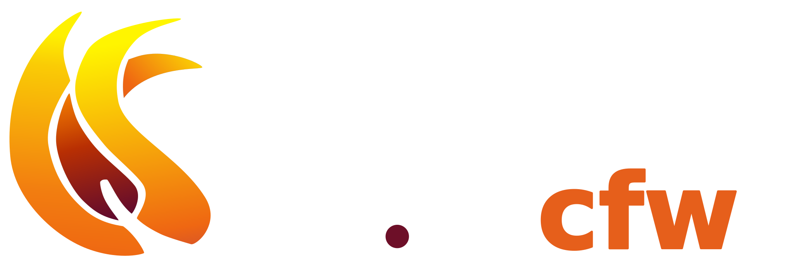

<h1 align=center>
    
</h1>

<h3 align=center>Isometric Template Components</h3>
<p align=center> <sub><b>v0.14.0</b></sub> </p>

The goal of Wick is reduce the cognitive overhead required to work with complex web code
and provide a flexible way to wrangle HTML, CSS, JavaScript, APIs, and custom code into 
manageable pieces that can be used in a variety of applications. 

### Static First 

Wick compiles components to static html documents. Depending on the input components, the output
may not have any javascript at all. The whole point of is to make is easy corral various together
and then get out of the way as much as possible let the browser do what it does best, render web
pages. 

Wick is designed to be easily, once the learning curve of discovering how the code works is surmounted.
Adding new features or revising old ones should be a breeze, allowing Wick to serve as a swiss army 
knife for creating web content. 

Want to create a static blog web site with template system and editor, wicks got you covered. Want 
to build a complete web editor in the browser, no problem; checkout CandleLibrary Flame for an example
of how Wick makes this possible.

Leverages syntax ambiguity:
    JavaScript leaves a lot up to imagination

#### Features
- Restricted syntax sugar on top of HTML, CSS, and JavaScript means less having to learn *how* to use
    wick, and more *using* wick to get the job done. Do more with less. 

- Full support of EcmaScript 2022, including import statements, await statements 

- Full suite implementation with CandleLibrary, 0 outside dependencies, small distribution

- Flexible component system with deterministic data flow. From simple drop in components to full applications, decide how your app should be structured.

- Built in dev server

- Static first design. Whatever can be made static is made static, meaning small distributions that load quickly with zero JS overhead. Wick Runtime can lazily load 
    components as users interact with document to reduce CPU time and increase perceptive performance.

- Backed by CandleLibrary Hydrocarbon, a flexible parser compiler that can be leveraged to expand Wick's syntax for even higher levels of customization and integration.

## Example 

A simple example

```jsx
//component-package-a.wick

//Import an outside style sheet into this component. 
import "./button-css.wick"

const greetings  = ["Hola", "Hello", "Salute", "こんにちは", "Helló"] //TODO should be hoisted to an internal, static property. 

export default  <button onclick={count++} > { greeting[count%greetings.length] } </button>

```

```CSS
/ /button-css.wick

// Wick Support both JSX like syntaxes as well as an HTML like syntax
<style>
    button {
        border:none;
        border-radius: 10px;
        padding: 10px 20px;
        <! Wick supports /*...*/, //..., & <! ... > comments anywhere >
        color: { ["red", "green", "blue" ][count%3] /* Even Here */ }
    }
</style>
```

A Todo App
```JSX
import { href } from "@model:std-location"

var todo = [{task: "Clean desk", COMPLETED:false}];

export default <div>
    
    <input type="text" 
        onclick:ENTER={ todo.push({ val:todo_string, COMPLETED:false }), "@input".value = "" }
    />

    <container data={todo} filter={!m.COMPLETED} hidden={ href=="#/active" || href=="#/all" }>
        <div>{val} <input type="checkbox" value={COMPLETED}}> </div>
    </container>

    <container data={todo} filter={m.COMPLETED} hidden={ href=="#/completed" || href=="#/all" }>
        <div>{val} <input type="checkbox" value={COMPLETED}}> </div>
    </container>

</div>;
```

A typical 
Hooks

Templating
Wick Hooks
Plugin
Learn More

Tutorial

- The Presets Object
- Static Data